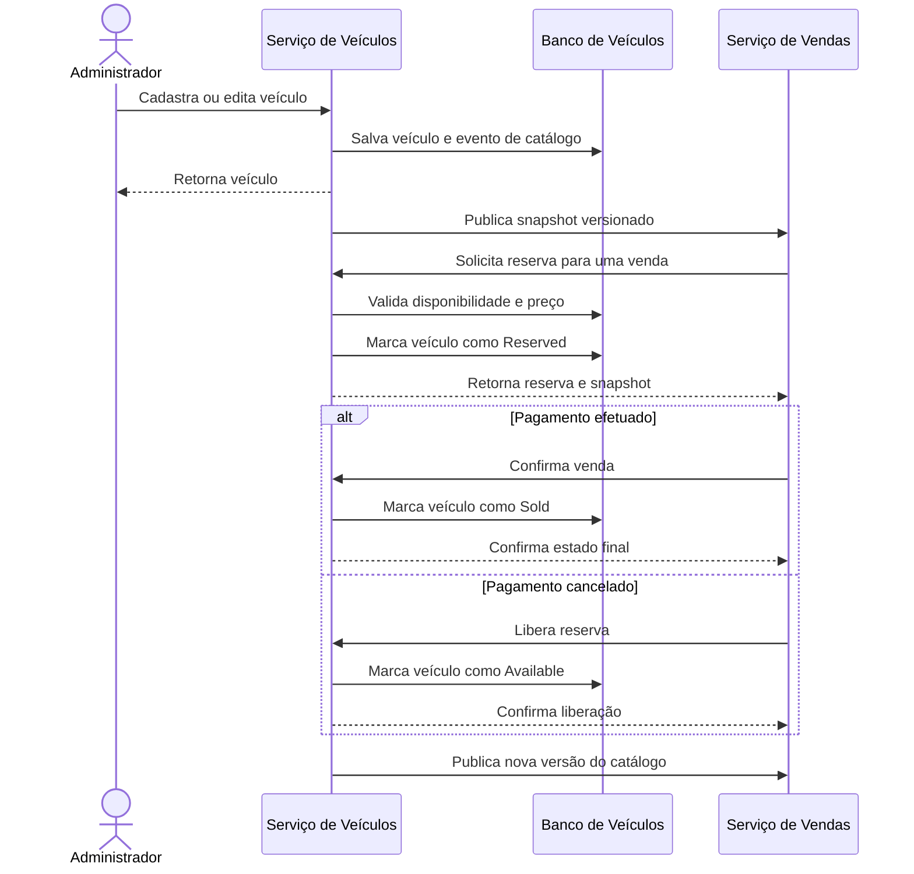

A divisão final possui três serviços executáveis: Veículos, Vendas e Processador de Pagamentos Mock. Cada serviço é dono de suas entidades e persistência; identificadores recebidos de outro serviço são referências externas, sem chave estrangeira entre bancos.

Esse documento define a estrutura e regras para o serviço de Veículos. Definições de outros serviços são citados apenas para fim de integração.
Com a divisão de aplicações, esta aplicação tem suas APIs restritas a usuários Admins e a chamadas sistemicas para integração.

Não realizar implementações que façam parte da aplicação de Vendas, esta será coberta em outro repositório.

## 1. Serviço de Veículos

Responsável pelos dados cadastrais do veículo e pela decisão autoritativa sobre disponibilidade, reserva e venda.

### Entidades

#### `Vehicle`

| Campo | Tipo/valores | Regra |
| --- | --- | --- |
| `Id` | UUID | Identificador do veículo |
| `Make` | string, até 120 caracteres | Marca obrigatória |
| `Model` | string, até 120 caracteres | Modelo obrigatório |
| `Year` | inteiro | Entre 1886 e o próximo ano |
| `Color` | string, até 50 caracteres | Cor obrigatória |
| `Price` | decimal `(14,2)` | Maior que zero |
| `Status` | `Available`, `Reserved`, `Sold` | Estado atual autoritativo |
| `ReservationSaleId` | UUID opcional | Venda que possui a reserva atual |
| `SoldSaleId` | UUID opcional | Venda que concluiu a aquisição |
| `CreatedAtUtc` | data/hora UTC | Data de cadastro |
| `UpdatedAtUtc` | data/hora UTC | Última alteração |
| `Version` | inteiro crescente | Concorrência e sincronização |

Regras principais:

- Novo veículo começa como `Available`.
- Somente `Available` pode ser editado ou reservado.
- `Reserved` pode tornar-se `Sold` pela mesma venda.
- `Reserved` pode voltar a `Available` se o pagamento for cancelado.
- `Sold` é terminal.

#### `VehicleReservation`

Histórico das reservas realizadas. Impede que uma requisição antiga volte a afetar o veículo.

| Campo | Tipo/valores | Regra |
| --- | --- | --- |
| `SaleId` | UUID | Chave primária; identificador criado por Vendas |
| `VehicleId` | UUID | Veículo reservado |
| `Status` | `Reserved`, `Confirmed`, `Released` | Situação da reserva |
| `MakeSnapshot` | string | Marca no momento da reserva |
| `ModelSnapshot` | string | Modelo no momento da reserva |
| `YearSnapshot` | inteiro | Ano no momento da reserva |
| `ColorSnapshot` | string | Cor no momento da reserva |
| `PriceSnapshot` | decimal `(14,2)` | Preço aceito na reserva |
| `VehicleVersionSnapshot` | inteiro | Versão reservada |
| `CreatedAtUtc` | data/hora UTC | Criação da reserva |
| `ConfirmedAtUtc` | data/hora opcional | Confirmação da venda |
| `ReleasedAtUtc` | data/hora opcional | Liberação da reserva |

`Confirmed` e `Released` são terminais.

#### `CatalogOutbox`

Entidade técnica que garante a sincronização do catálogo com Vendas.

| Campo | Tipo/valores | Regra |
| --- | --- | --- |
| `Id` | UUID | Identificador do evento |
| `VehicleId` | UUID | Veículo alterado |
| `VehicleVersion` | inteiro | Versão enviada |
| `PayloadJson` | JSON | Snapshot integral do veículo |
| `CreatedAtUtc` | data/hora UTC | Criação |
| `ProcessedAtUtc` | data/hora opcional | Entrega confirmada |
| `Attempts` | inteiro | Número de tentativas |
| `NextAttemptAtUtc` | data/hora opcional | Próxima tentativa |
| `LastError` | string opcional | Último erro sanitizado |
| `LeaseOwner` | string opcional | Worker que assumiu o item |
| `LeaseExpiresAtUtc` | data/hora opcional | Expiração do lease |

### História de negócio



### Endpoints por comportamento

**Cadastro e manutenção**

| Método | Endpoint | Comportamento |
| --- | --- | --- |
| `POST` | `/api/v1/vehicles` | Cadastra veículo |
| `PUT` | `/api/v1/vehicles/{id}` | Edita veículo disponível |
| `GET` | `/api/v1/vehicles/{id}` | Consulta administrativa individual |
| `GET` | `/api/v1/vehicles` | Listagem administrativa geral de veículos |
| `GET` | `/api/v1/vehicles/{id}/reservations/` | Listagem administrativa de Reservas para o veículo alvo |
| `GET` | `/api/v1/reservations/` | Listagem administrativa de Reservas geral |

**Reserva e conclusão da venda**

| Método | Endpoint | Comportamento |
| --- | --- | --- |
| `PUT` | `/internal/v1/vehicles/{id}/reservations/{saleId}` | Reserva veículo e valida preço |
| `PUT` | `/internal/v1/vehicles/{id}/reservations/{saleId}/confirmation` | Confirma venda e marca veículo como vendido |
| `PUT` | `/internal/v1/vehicles/{id}/reservations/{saleId}/release` | Libera reserva após cancelamento |

**Operação**

| Método | Endpoint | Comportamento |
| --- | --- | --- |
| `GET` | `/health` | Verifica aplicação e banco |
| `GET` | `/health/live` | Verifica se o processo está ativo |

A publicação do catálogo para Vendas é iniciada internamente pelo worker, usando `PUT /internal/v1/catalog/vehicles/{id}` no serviço de Vendas.

---------

## 2 Veículos — tabelas

- `vehicles`: campos atuais, `status` Available/Reserved/Sold, `reservation_sale_id` nullable, `sold_sale_id` nullable, `version` crescente. Reservar atribui saleId; confirmar mantém a referência final; liberar limpa apenas a reserva daquele saleId. Incrementar versão em toda alteração.
- `vehicle_reservations`: `sale_id` PK, `vehicle_id`, `status` Reserved/Confirmed/Released, snapshot de marca/modelo/ano/cor/preço/versão aceitos, timestamps. O histórico impede uma repetição antiga de reserva de reabrir uma reserva já liberada; não apagar durante a entrega.
- `catalog_outbox`: `id`, `vehicle_id`, `vehicle_version`, `payload_json`, `created_at_utc`, `processed_at_utc`, `attempts`, `next_attempt_at_utc`, `last_error`, campos de lease. Inserir snapshot integral junto com a alteração de Vehicle na mesma transação.
- Manter índice `(status, price, id)`; unicidade de versão por veículo na outbox. Reserva e edição devem disputar a mesma linha/token de concorrência. Mapear conflito para 409.

## 3. Estados e consistência entre aplicações

```text
Vehicle: Available -> Reserved -> Sold
                         |-> Available (pagamento cancelado)

Sale: Reserving -> AwaitingPayment -> ConfirmingVehicle -> Completed
           |               |-> CancellingVehicle -> Cancelled
           |-> Rejected (404/409 definitivo na reserva)

Payment.Mock: Pending -> Paid OU Cancelled (terminal)
```

### 3.1 Compra

1. API de Venda valida JWT, CPF e Idempotency-Key. Procura `(subject,key)` antes de validar disponibilidade atual. Mesma chave e payload normalizado retorna a venda existente; payload diferente retorna 409. A chave não pode criar venda para outro veículo/CPF.
2. Em transação local, cria Sale em Reserving com saleId e paymentCode UUID gerados por Vendas. Persistir antes de chamar qualquer serviço. Restrição única resolve compras concorrentes também entre réplicas. Devolver 202 com Location de consulta; worker prossegue imediatamente ou na próxima varredura.
3. Worker chama reserva em *Veículos usando saleId e o preço esperado da compra. Em *Veículos, transação curta bloqueia veículo, valida Available/preço, cria registro de reserva e outbox e confirma. Resposta contém snapshot e versão. Repetir mesma operação devolve reserva existente. 404/409 definitivos levam a Rejected; timeout mantém Reserving para repetição, pois reserva pode ter sido aplicada.
4. Vendas persiste snapshot/preço autoritativos, atualiza projeção por versão e passa a AwaitingPayment. O preço esperado evita comprar silenciosamente por outro valor quando o catálogo estiver atrasado.
5. Worker cria pagamento no Mock com paymentCode estável. Mesmo código/payload retorna o pagamento existente. Grava paymentRegisteredAtUtc após resposta. Crash após criação é recuperado por repetição. Callback pode chegar antes dessa gravação: já existe Sale com paymentCode e AwaitingPayment e deve aceitá-lo.

### 3.2 Pagamento efetuado

1. Operador aprova Pending no Mock. Transação local grava Paid + eventId estável + data, deixando callback pendente.
2. Worker do Mock envia webhook. Vendas autentica a origem, encontra paymentCode, bloqueia Sale, grava callback e muda AwaitingPayment para ConfirmingVehicle; retorna 202 após commit. Duplicata equivalente retorna 200. Não precisa aguardar *Veículos para responder.
3. Worker de Vendas confirma reserva via HTTP. *Veículos exige saleId proprietário, marca Sold e reserva Confirmed e cria outbox na mesma transação. Repetição de confirmação já aplicada retorna 200.
4. Vendas grava Completed e completedAtUtc, e aplica a versão retornada ao catálogo. A data da venda é completedAtUtc; paymentOccurredAtUtc fica separada. O vendido usa o snapshot/preço da reserva, independentemente do atraso da projeção.

### 3.3 Pagamento cancelado

Mesmo início, com resultado Cancelled e Sale em CancellingVehicle. Worker libera a reserva por HTTP. *Veículos marca reserva Released e veículo Available, produzindo nova versão/outbox. Vendas só grava Cancelled depois da liberação confirmada. Nova compra usa nova chave, saleId e paymentCode. Uma liberação repetida de reserva Released é 200 e **não modifica** reserva posterior de outra venda.

### 3.4 Sincronização do catálogo

Escolha: outbox pequena em *Veículos + entrega HTTP de snapshots para Vendas. Escrever banco e disparar HTTP sem persistir pendência perderia atualizações em uma queda; aqui aplica-se a persistência da pendência com transporte HTTP, sem broker.

Worker envia `PUT /internal/v1/catalog/vehicles/{vehicleId}`. Vendas faz upsert condicional por versão: maior aplica, menor ignora, igual com mesmo payload é no-op; igual divergente retorna 409 e gera diagnóstico. Retornos de reserva/confirmação/liberação usam a mesma regra. Atraso/reordenação nunca pode substituir Sold v5 por Available v3.

## 4. Endpoints e contratos HTTP

### 4.1 Convenções comuns

JSON camelCase, enums como strings, IDs UUID, versão inteira crescente, dinheiro decimal BRL. Paginação atual: page=1, pageSize=20, máximo 100; resposta `{items,page,pageSize,totalCount}`. Ordenar por preço crescente e ID crescente para desempate. Rotas de listagem são preservadas e mudam de host. Body inválido 400; sem autenticação 401; sem permissão 403; inexistente 404; conflito 409; falha temporária antes de persistir aceitação 503. Erros em ProblemDetails com `code` estável e `traceId`, sem detalhes sensíveis.

JWT Cognito para usuários. Integrações usam chaves distintas por direção em headers, configuradas por secret e HTTPS no ambiente publicado; não confiar só no prefixo `/internal`. Exemplo: `X-Service-Key` para Veículos↔Vendas e Vendas→Mock, `X-Payment-Webhook-Key` exclusivo para Mock→Vendas. Policies separadas impedem token de comprador de executar comandos internos. Endereços de destino vêm da configuração, nunca de URL arbitrária no request. Propagar traceparent; não registrar headers de autenticação.

### 4.2 Veículos

| Método/rota | Autor | Request | Sucesso |
| --- | --- | --- | --- |
| POST `/api/v1/vehicles` | Admin | make, model, year, color, price | 201 + VehicleResponse; Location da consulta individual |
| PUT `/api/v1/vehicles/{id}` | Admin | mesmos campos + version | 200 + VehicleResponse; 409 se versão obsoleta/reservado/vendido |
| GET `/api/v1/vehicles/{id}` | Admin | — | 200 + VehicleResponse |
| PUT `/internal/v1/vehicles/{id}/reservations/{saleId}` | Vendas | expectedPrice | 201 na primeira reserva, 200 na repetição equivalente |
| PUT `/internal/v1/vehicles/{id}/reservations/{saleId}/confirmation` | Vendas | `{}` | 200 + VehicleSnapshot |
| PUT `/internal/v1/vehicles/{id}/reservations/{saleId}/release` | Vendas | `{}` | 200 + VehicleSnapshot |
| GET `/health`, `/health/live` | Operação | — | 200 saudável; health considera DB e live só processo |

`VehicleResponse` preserva id, make, model, year, color, price, status, createdAtUtc, updatedAtUtc e version. Reserva devolve `{saleId,reservationStatus,vehicle:{...VehicleSnapshot}}`; snapshot: `{id,make,model,year,color,price,status,version,updatedAtUtc}`. Repetição da criação da reserva verifica payload original antes de responder; reserva já Released/Confirmed não pode ser recriada: 409 `reservation_terminal`. Confirmação de reserva liberada, liberação de confirmada e comandos com proprietário errado são 409. Reserva inexistente é 404. Confirmação/liberação já concluída devolve status atual do veículo, sem reaplicar alteração, permitindo projeção por versão.

### 4.3 Vendas

| Método/rota | Autor | Request | Sucesso |
| --- | --- | --- | --- |
| GET `/api/v1/vehicles/available` | Público | page/pageSize | 200 catálogo local Available |
| GET `/api/v1/sales/sold` | Público | page/pageSize | 200 veículos de vendas Completed |
| POST `/api/v1/vehicles/{id}/purchase` | Comprador | buyerCpf, expectedPrice; header Idempotency-Key obrigatório | 202 + SaleResponse + Location |
| GET `/api/v1/sales/{saleId}` | Dono ou admin | — | 200 + SaleResponse; outro comprador recebe 404 |
| POST `/api/v1/payments/webhook` | Mock/processador | paymentCode, eventId, status, occurredAtUtc | 202 persistido; 200 repetido equivalente |
| PUT `/internal/v1/catalog/vehicles/{id}` | Veículos | VehicleSnapshot | 204 aplicado/antigo/repetido |
| GET `/health`, `/health/live` | Operação | — | Convenção comum |

## 5. Guia de implementação — Veículos

Árvore alvo; itens entre parênteses são observações e não nomes de arquivos.

```text
FIAP-AutoSale.Vehicles/
  AutoSale.Vehicles.slnx
  Directory.Build.props / Directory.Packages.props
  src/
    AutoSale.Vehicles.Api/
      Controllers/VehiclesController.cs
      Controllers/VehicleReservationsController.cs
      Contracts/Vehicles/{CreateVehicleRequest,UpdateVehicleRequest,VehicleResponse}.cs
      Contracts/Reservations/{ReserveVehicleRequest,ReservationResponse}.cs
      Authentication/ / Authorization/ / Extensions/ / Middleware/
      Program.cs / appsettings.json / Dockerfile
    AutoSale.Vehicles.Application/
      Vehicles/Create/ / Update/ / GetById/ / List/
      Vehicles/Reserve/ / ConfirmSale/ / ReleaseReservation/ / ListReservations/ / ListVehicleReservations/
      Catalog/PublishPending/ / Rebuild/
      Abstractions/Persistence/{IVehicleRepository,IReservationRepository,IUnitOfWork,ICatalogOutboxRepository}.cs
      Abstractions/Integrations/ISalesCatalogClient.cs
      Abstractions/Clock/IClock.cs
      Common/
    AutoSale.Vehicles.Domain/
      Vehicles/{Vehicle,VehicleStatus,VehicleErrors}.cs
      Reservations/{VehicleReservation,ReservationStatus}.cs
    AutoSale.Vehicles.Infrastructure/
      Persistence/AutoSale.VehiclesDbContext.cs
      Persistence/Configurations/ / Repositories/ / Migrations/
      Integrations/Sales/{SalesCatalogClient,SalesIntegrationOptions}.cs
      BackgroundServices/CatalogPublisherWorker.cs
      DependencyInjection.cs / Clock/
    BuildingBlocks/AutoSale.SharedKernel/
  tests/
    AutoSale.Vehicles.Domain.UnitTests/
    AutoSale.Vehicles.Application.UnitTests/
    AutoSale.Vehicles.ArchitectureTests/
    AutoSale.Vehicles.Api.IntegrationTests/
  docs/contracts/openapi.yaml
  docs/runbooks/{local,deploy,data-migration}.md
  deploy/compose/integration.yml
  scripts/{check-coverage,smoke,rebuild-catalog}.ps1
  .github/workflows/{ci,cd}.yml
  README.md / docker-compose.yml / .env.example
```

Relacionamentos: Controller → handler → Vehicle/VehicleReservation + portas de persistência → implementações EF. `ReserveVehicleHandler`, `ConfirmVehicleSaleHandler`, `ReleaseVehicleReservationHandler` delimitam transações locais; inserem snapshot na outbox antes do commit. `CatalogPublisherWorker` cria escopo de DI → `PublishPendingCatalogHandler` → `ISalesCatalogClient` → HTTP. Application nunca usa HttpClient/DbContext diretamente. Domain não conhece integração ou autenticação.

Manter `CreateVehicleHandler` e `UpdateVehicleHandler`, acrescentando outbox e concorrência explícita. Mover ListAvailable para Vendas; remover Purchase do controller e remover Domain/Sales, Application/Sales, ISaleRepository, SaleRepository e registro DI correspondente somente após extração. Migration posterior remove tabela sales antiga conforme decisão de dados. Remover testes de Sales apenas depois de portados ao repo B; adaptar testes de Vehicle para Reserved e reserva idempotente.

## 6. Infraestrutura, CI/CD e operação

### Execução local

Compose individual de cada repo levanta sua aplicação, banco e dependências simuladas necessárias aos testes; não exige clonar outro repo para rodar testes. Para a demonstração completa, `deploy/compose/integration.yml` no repo A usa imagens publicadas de Veículos, Vendas e Mock fixadas por tag SHA. Documentar opção de build com checkouts irmãos `FIAP-AutoSale/` e `FIAP-AutoSale-Sales/`, por override local.

Portas propostas: Veículos 8080, Vendas 8081, Mock 8082; PostgreSQL de Veículos 5432 e de Vendas 5433 somente para inspeção local. Usar dois serviços PostgreSQL, volumes e usuários diferentes; nenhum usuário com grants no outro banco. Mock usa volume SQLite exclusivo. Compose integrado identifica explicitamente as três versões e permite atualizar uma aplicação sem reconstruir as outras.